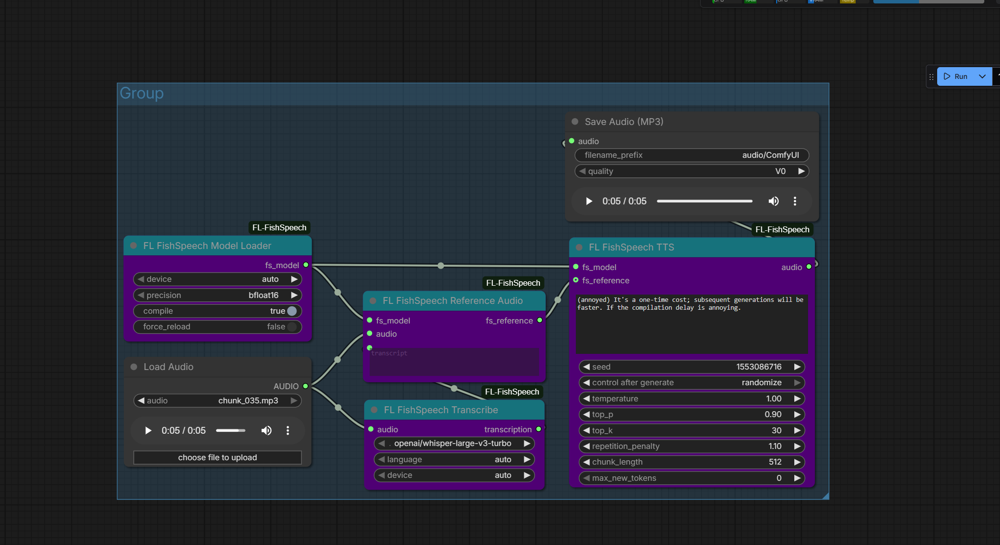

# FL FishSpeech

AI text-to-speech and voice cloning nodes for ComfyUI powered by OpenAudio S1-mini (Fish Audio). High-quality 44.1kHz speech synthesis with zero-shot voice cloning from a single reference clip.

[](https://github.com/fishaudio/fish-speech)
[](https://www.patreon.com/Machinedelusions)



## Features

- **Voice Cloning** - Clone any voice from a single reference audio clip (5-30 seconds)
- **High-Quality Audio** - 44.1kHz output via DAC neural codec
- **DualAR Transformer** - 860M parameter model for natural-sounding speech
- **Emotion Control** - Inline tags like `[laugh]`, `[whispers]`, `[angry]` for expressive speech
- **Whisper Transcription** - Built-in transcription node for generating reference text
- **Per-Token Progress** - Real-time progress bar tracking during generation
- **torch.compile Support** - Optional JIT compilation for faster inference

## Nodes

| Node | Description |
|------|-------------|
| **Model Loader** | Load OpenAudio S1-mini transformer + DAC codec |
| **Reference Audio** | Encode reference audio + transcript for voice cloning |
| **TTS** | Generate speech from text with optional voice cloning |
| **VQ Encode** | Encode audio to VQ codes (discrete audio representation) |
| **VQ Decode** | Decode VQ codes back to audio waveform |
| **Transcribe** | Transcribe audio to text using Whisper |

## Installation

### ComfyUI Manager
Search for "FL FishSpeech" and install.

### Manual
```bash
cd ComfyUI/custom_nodes
git clone https://github.com/filliptm/ComfyUI-FL-FishSpeech.git
cd ComfyUI-FL-FishSpeech
pip install -r requirements.txt
```

## Quick Start

1. Add **FL FishSpeech Model Loader** — models download automatically on first use
2. For voice cloning:
   - Load a reference audio clip (5-30 seconds of clear speech)
   - Connect to **FL FishSpeech Transcribe** to get the transcript
   - Connect both audio and transcript to **FL FishSpeech Reference Audio**
3. Add **FL FishSpeech TTS** node
   - Connect the model and optional reference
   - Enter your text
4. Connect output to **Preview Audio** or **Save Audio**

### Basic TTS (No Cloning)
```
Model Loader → TTS → Preview Audio
```

### Voice Cloning Pipeline
```
Model Loader ─────────────────→ TTS → Preview Audio
                                 ↑
Load Audio → Transcribe ──→ Reference Audio
         └────────────────→
```

## Emotion & Expression Tags

FishSpeech supports inline expression tags within your text:

| Tag | Effect |
|-----|--------|
| `[laugh]` | Laughter |
| `[whispers]` | Whispering voice |
| `[angry]` | Angry tone |
| `[sad]` | Sad tone |
| `[excited]` | Excited delivery |

Example: `Hello! [laugh] That's so funny. [whispers] But don't tell anyone.`

## Parameters

### TTS Settings

| Parameter | Default | Range | Description |
|-----------|---------|-------|-------------|
| `temperature` | 1.0 | 0.1-2.0 | Sampling randomness. Higher = more varied |
| `top_p` | 0.9 | 0.1-1.0 | Nucleus sampling threshold |
| `top_k` | 30 | 1-100 | Top-k token filtering |
| `repetition_penalty` | 1.1 | 1.0-2.0 | Penalize repeated tokens |
| `chunk_length` | 512 | 50-1000 | Max bytes per text chunk |
| `max_new_tokens` | 0 | 0-4096 | Max tokens per chunk (0 = auto) |
| `seed` | 0 | 0-2^31 | Random seed (0 = random) |

### Model Loader Settings

| Parameter | Default | Description |
|-----------|---------|-------------|
| `device` | auto | Device selection (auto, cuda, cpu) |
| `precision` | bfloat16 | Model precision (bfloat16 recommended for CUDA) |
| `compile` | false | Enable torch.compile (slow first run, faster after) |

### Transcribe Settings

| Parameter | Default | Description |
|-----------|---------|-------------|
| `model` | whisper-large-v3-turbo | Whisper model variant |
| `language` | auto | Language code or auto-detect |

## Model

| Model | Parameters | VRAM | Output |
|-------|-----------|------|--------|
| OpenAudio S1-mini | ~860M | ~14GB | 44.1kHz mono audio |

Models download automatically on first use to `ComfyUI/models/fishspeech/`.

The model uses a **DualAR (Dual Autoregressive) Transformer** for semantic token generation and a **DAC (Descript Audio Codec)** with 10 codebooks for high-quality audio reconstruction.

## Requirements

- Python 3.10+
- 16GB RAM minimum
- NVIDIA GPU with 14GB+ VRAM recommended

### Supported Platforms

| Platform | Device | Notes |
|----------|--------|-------|
| **NVIDIA GPU** | CUDA | 14GB+ VRAM, bfloat16 recommended |
| **Apple Silicon** | MPS | M1/M2/M3/M4 supported |
| **CPU** | CPU | Very slow, not recommended |

## Credits

- [fishaudio/fish-speech](https://github.com/fishaudio/fish-speech) - Original model and codebase
- [Fish Audio](https://fish.audio/) - OpenAudio S1-mini model

## License

Apache 2.0
